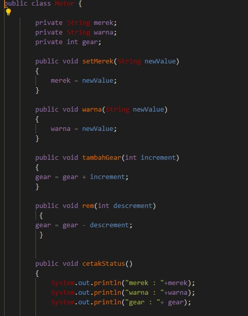
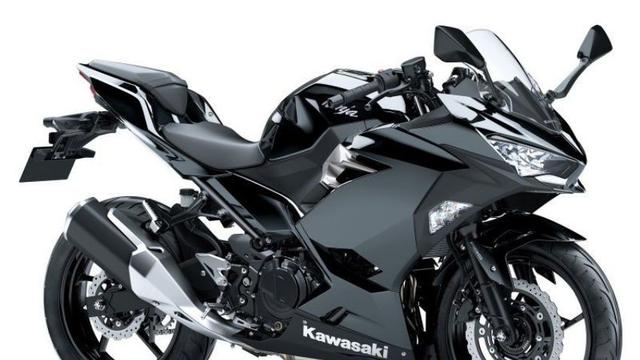
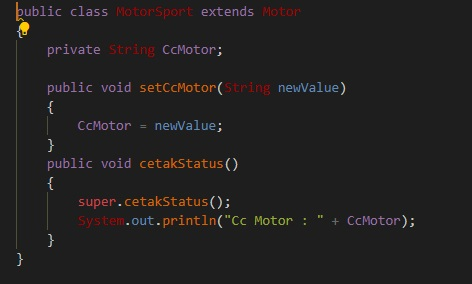
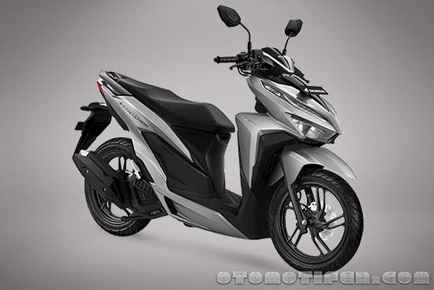
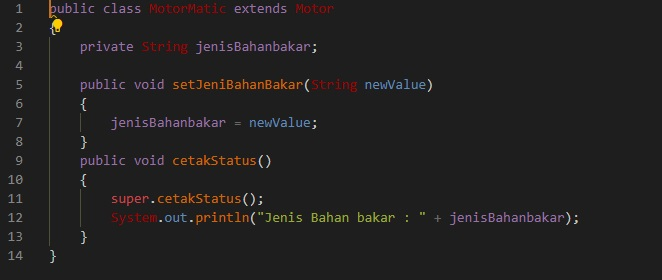
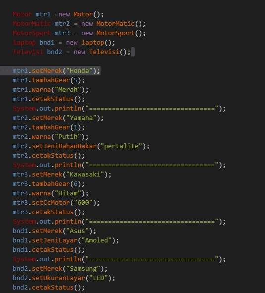
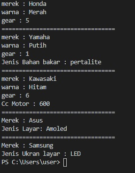

# Tugas Praktikum 1

<blockquote>class Motor </blockquote>

<h4>penjelasan </h4>

Class motor induk yang memawrisi dari class MotorMatic dan Class MotorMatic
terdapat 3 attibut dan 3 method

<blockquote>MotorSport </blockquote>

<h4>class </h4>

<h4>penjelasan </h4>

di class Motor sport memliki 4 atribut yang 3 i antaranya diambil dari
clas motor yang merupakan class induk

<blockquote>MotorMatic </blockquote>

<h4>class </h4>

<h4>penjelasan </h4>

Class Motor Matic Memiliki 4 atribut yang 3 di antaranya diambil dari
class motor yang merupakan class induk

# Main

penjelasan

Class Main untuk menjalankan program menghasilkan sebuah output. untuk menjalankannya,
kami melakukan pembuatan objek atau instansiasi dari class diatas, kemudian kami melakukan pemanggilan 
method dari objek kemudian melakukan

<h4>output <h4>

