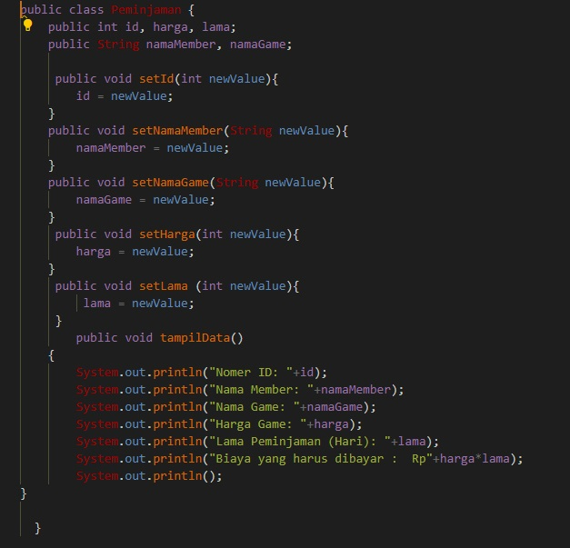
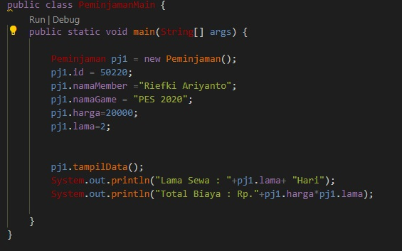
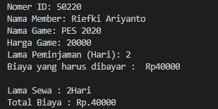
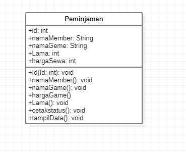
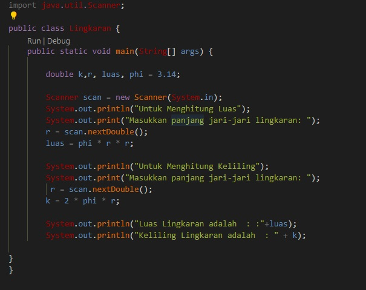
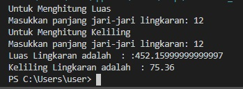
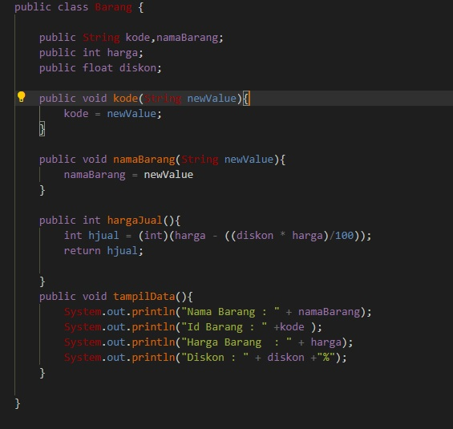
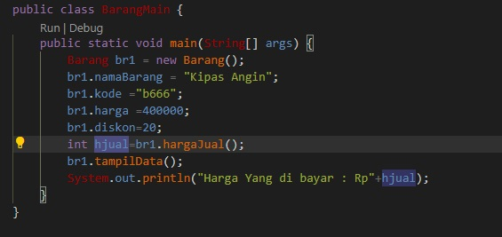

# TUGAS PRAKTIKUM PERTEMUAN 2

1.    Suatu toko persewaan video game salah satu yang diolah adalah peminjaman, dimana
data yang dicatat ketika ada orang yang melakukan peminjaman adalah id, nama
member, nama game, dan harga yang harus dibayar. Setiap peminjaman bisa
menampilkan data hasil peminjaman dan harga yang harus dibayar. Buatlah class
diagram pada studi kasus diatas!
Penjelasan:

     Harga yang harus dibayar diperoleh dari lama sewa x harga.

     Diasumsikan 1x transaksi peminjaman game yang dipinjam hanya 1 game saja.
    
 CLass 

   

   Main 

   

   Output 

   

2. Buatlah program dari class diagram yang sudah anda buat di no 1!

 

 

 

3. 

class Mengghitung luas Dan keliling linkaran

Output

  

4. Buatlah program sesuai dengan class diagram berikut ini:

Deskripsi / Penjelasan :

 Nilai atribut hargaDasar dalam Rupiah dan atribut diskon dalam %

 Method hitungHargaJual() digunakan untuk menghitung harga jual dengan
perhitungan berikut ini:
harga jual = harga dasar – (diskon x harga dasar)

 Method tampilData() digunakan untuk menampilkan nilai dari kode, namaBarang,
hargaDasar, diskon dan harga jual

Class 

Main

Output

